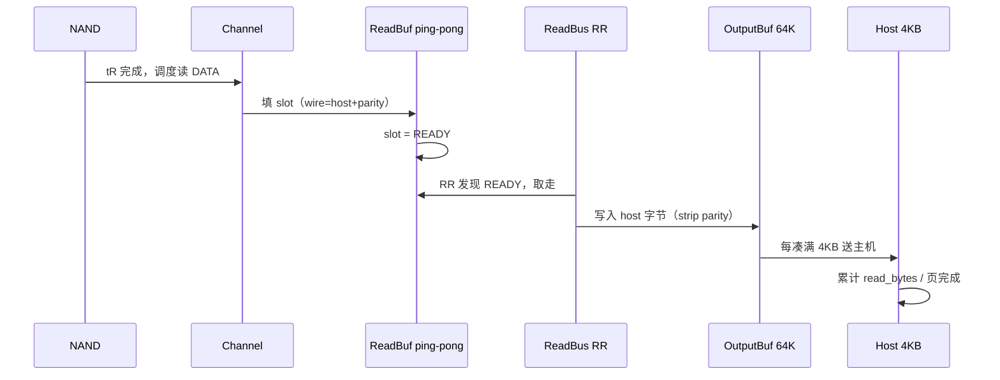
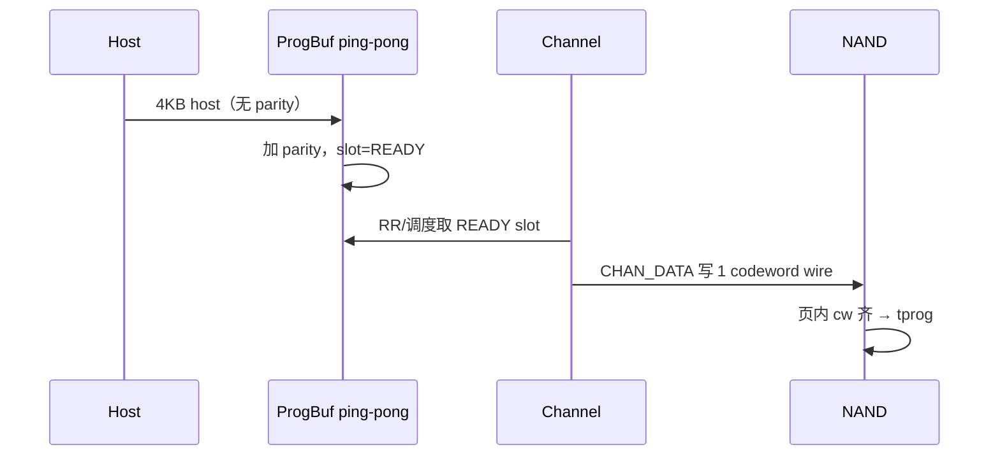
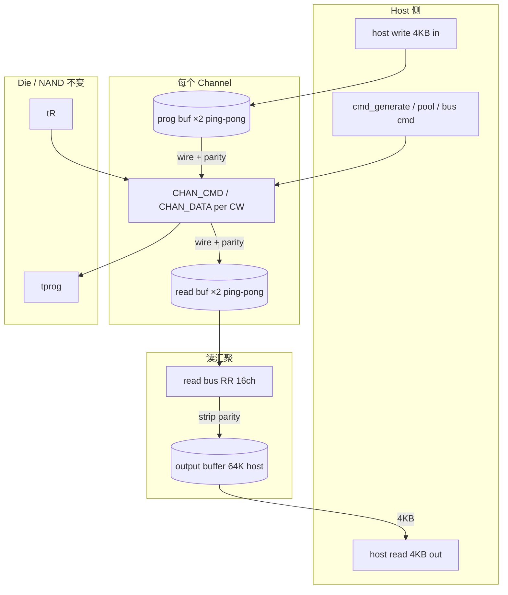

# Channel Codeword Buffer 设计

> 状态：**Review 已定稿**（待实现）  
> 目标：在现有 **generate → pool → bus → channel → die/NAND** 栈上，为每个 channel 增加 **双 codeword ping-pong buffer**、**读总线轮询**、**64KB output buffer** 与 **4KB 主机读粒度**，并对称建模写侧 program buffer。

---

## 1. 需求理解（原文拆解）

### 1.1 每个 NAND channel 的前端缓冲

每个 channel **独立**拥有：

| 缓冲 | 数量 | 容量 | 作用 |
|------|------|------|------|
| **Program buffer** | 2（ping-pong） | 1 codeword（含 parity） | 写：主机数据先入 buffer，凑满 1 codeword 后经 channel 下发 NAND |
| **Read buffer** | 2（ping-pong） | 1 codeword（含 parity） | 读：NAND 经 channel 上来的数据（含 LDPC parity）先进入 buffer |

**Ping-pong 语义**：

- 写：slot0 在 channel 传数时，slot1 可并行接收下一 codeword 的 host 数据并生成 parity → **READY**。
- 读：slot0 在被读总线取走时，slot1 可并行经 channel 填充。

### 1.2 数据形态（parity 边界）

| 阶段 | 读 | 写 |
|------|----|----|
| 刚离开/进入 channel | **含 parity**（LDPC） | **含 parity**（program buffer 内已附加） |
| 主机侧 / output buffer | **不含 parity**（纯 host 字节） | 主机写入 **不含 parity** |
| program / read buffer 内部 | read buffer 存 wire 形态 | program buffer 存 wire 形态（host + parity） |

### 1.3 读总线与 output buffer

1. **读总线**：对 16 个 channel 的 read buffer **轮询（RR）**；发现某 slot **READY** 则发起传输。
2. 读总线把 codeword 送到 **64KB output buffer**（汇聚点）；进入 output buffer 时 **剥离 parity**，只计 host 字节。
3. **主机读出口**：从 output buffer 以 **4KB 为粒度** 向主机送数（与 `cmd_size=4096` 对齐）。

### 1.4 写路径（对称理解）

1. 主机以 **4KB（无 parity）** 写入路径进入后端（可与现有 `bus_xfer` / 新 write-data 路径衔接）。
2. 数据进入 **program buffer** 某一 slot；buffer 内附加 parity 后标记 **READY**。
3. channel 空闲且该 slot READY 时，经 channel 传 **wire 字节（host+parity）** 到 NAND 侧（对应当前 `CHAN_DATA` 写阶段）。
4. 一页内多个 codeword 全部 program 完成后，仍走现有 **tprog**（建议 Phase 1 保持 **按 page tprog**，不按 codeword）。

---

## 2. 与现有模型的关系

### 2.1 当前栈（P0 已实现）

```
Host  cmd_generate → cmd_pool → bus_xfer(cmd) → die队列
                                              → CHAN_CMD / CHAN_DATA → tR / tprog
```

- **CHAN_DATA** 一次传整页：`page_size + parity`，时间 `data_time_*_page`。
- **read_bytes / write_bytes** 在 CHAN_DATA 完成时按 **host 页字节** 累计。
- **无** channel 侧 ping-pong、无读总线、无 output buffer。

### 2.2 目标栈（本设计）

```
读（NAND → Host）:
  die tR 完成 → [channel 读 1 codeword → read_buf[ch][ping]] 
             → read_bus(RR 16ch) → output_buf(64K, host only) 
             → host_read_port(4KB) → 统计/命令完成

写（Host → NAND）:
  host_write_port(4KB) → prog_buf[ch][ping] (+parity, READY)
             → channel 写 1 codeword → die/NAND → tprog(仍按 page)
```

**不变（Phase 1）**：

- `cmd_generate` / `cmd_pool` / `bus_xfer`（**命令**路径）
- die slot 状态机：CMD、tR、tprog、erase、suspend
- stripe、page stripe 写（1 CMD + 多 page DATA/tprog）的 **命令级** 逻辑

**变化**：

- **CHAN_DATA 粒度** 从「整页」改为「单 codeword（wire 字节）」；页 = N 个 codeword 顺序/流水。
- 新增 **channel buffer / read bus / output buffer / host 4KB 端口** 模块。
- 带宽统计：host 字节仍在 **output buffer → host**（读）和 **host → prog buffer**（写）计数；wire 字节用于 channel 时间。

---

## 3. 核心参数（建议配置）

| 配置项 | 默认 | 说明 |
|--------|------|------|
| `codeword_host_bytes` | `4096` | 1 codeword 的 host 净荷 |
| `codeword_read_parity_bytes` | 派生或独立 | 读 channel wire 上每 codeword 的 parity 字节 |
| `codeword_write_parity_bytes` | 派生或独立 | 写 channel wire 上每 codeword 的 parity 字节 |
| `read_ping_pong_slots` | `2` | 每 channel read buffer 槽位数（固定 2） |
| `prog_ping_pong_slots` | `2` | 每 channel program buffer 槽位数（固定 2） |
| `output_buffer_bytes` | `65536` | 读汇聚 buffer |
| `host_read_chunk_bytes` | `4096` | 向主机送读数据粒度 |
| `host_write_chunk_bytes` | `4096` | 从主机收写数据粒度 |
| `read_bus_bandwidth` | `0`（不限） | 读总线 MB/s，与 `bus_bandwidth` 独立 |
| `use_codeword_buffers` | `0` | **0=保持现行为**；1=启用本模型 |

**派生关系（兼容现有 perf.conf）**：

```
codewords_per_page = page_size / codeword_host_bytes     # 16384/4096 = 4
read_cw_parity  = ecc_parity_size / codewords_per_page   # 可选：600/4=150
write_cw_parity = page_parity_size / codewords_per_page  # 1952/4=488
read_cw_wire    = codeword_host_bytes + read_cw_parity
write_cw_wire   = codeword_host_bytes + write_cw_parity
data_time_read_cw  = read_cw_wire * TIME_SCALE / chan_speed
data_time_write_cw = write_cw_wire * TIME_SCALE / chan_speed
```

> Review 点：parity 按页均分到 codeword 是否足够，还是需要独立配置每 codeword parity？

---

## 4. 数据结构

### 4.1 单 slot（read / program 共用形态）

```c
typedef enum {
    CW_SLOT_EMPTY,
    CW_SLOT_FILLING,   /* channel 正在写入 read_buf / host 正在填充 prog_buf */
    CW_SLOT_READY,     /* 可给 read_bus / channel 写口消费 */
    CW_SLOT_XFER,      /* 正在被 read_bus 或 channel 读走 */
} cw_slot_state_t;

typedef struct cw_slot_s {
    cw_slot_state_t state;
    int act;           /* 关联 host 命令 */
    int page_idx;      /* page stripe 内页号，-1 表示 legacy */
    int cw_idx;        /* 页内 codeword 序号 [0, codewords_per_page) */
    uint64_t ready_time; /* 可选：parity 生成延迟 */
} cw_slot_t;
```

### 4.2 每 channel

```c
typedef struct chan_cw_buf_s {
    cw_slot_t read_slot[2];
    cw_slot_t prog_slot[2];
    int read_fill_slot;   /* 下一 channel 读目标 slot */
    int prog_drain_slot;  /* 下一 channel 写源 slot */
} chan_cw_buf_t;
```

### 4.3 读总线

```c
typedef struct read_bus_s {
    int state;              /* IDLE / XFER */
    int rr_chan;
    uint64_t busy_until;
    int active_ch, active_slot;
    uint64_t xfer_host_bytes; /* 本次 xfer 剥离 parity 后的 host 字节 */
} read_bus_t;
```

### 4.4 Output buffer（读汇聚）

```c
typedef struct output_buffer_s {
    int fill_bytes;         /* 当前 host 字节占用 [0, 65536] */
    queue_t host_chunks;    /* 可选：待送主机 4KB chunk 队列（元素为 act+offset） */
} output_buffer_t;
```

### 4.5 页级 codeword 进度（挂在 act 上）

```c
/* 侧车数组，page stripe / 多页块使用 */
int *cmd_cw_read_done;    /* 已进 output buffer 的 codeword 数 */
int *cmd_cw_write_done;   /* 已从 host 进 prog 并完成 channel 写的 codeword 数 */
int cmd_cw_total(act);    /* pages_per_block * codewords_per_page */
```

---

## 5. 状态机与时序

### 5.1 读路径（详细）



**与现有 `try_schedule_read_data` 的衔接**：

1. tR 完成 → 不再直接 `CHAN_DATA` 传整页。
2. 改为：若 `read_buf[ch]` 有空 **EMPTY** slot → `CHAN_DATA` **1 个 codeword**（`data_time_read_cw`）→ slot **READY**。
3. 页内 codeword 按 `cw_idx=0..N-1` 顺序发起；ping-pong 允许 **slot1 在 channel 传 slot0 下一 cw 时并行接收**（若调度允许下一 codeword 已 tR 就绪——Phase 1 可简化为 **同一 die 页内 codeword 串行 tR 一次，codeword 仅拆分 DATA**）。

> **Phase 1 简化**：1 次 tR / page，DATA 拆成 `codewords_per_page` 次 CHAN_DATA；ping-pong 只重叠 **channel DATA** 与 **read_bus**。

**Read bus 调度**（每 sim step，在 channel 调度之后或并列）：

```
read_bus_process(sim_time):
  if XFER 完成: 把 host 字节写入 output_buffer; slot=EMPTY; state=IDLE
  if IDLE:
    for j in 0..chan_num-1:
      ch = (rr_chan + j) % chan_num
      if read_buf[ch] 有 READY slot:
        启动 XFER，耗时 = read_cw_wire 或 read_bus 带宽限制
        rr_chan = ch+1; return
```

**Output buffer → Host**：

```
output_buffer_drain(sim_time):
  while fill_bytes >= 4096 && host 读端口可接受:
    fill_bytes -= 4096
    read_bytes += 4096
    更新 act 的 cmd_cw_read_done / 页完成 / host 命令完成（与原 page stripe 一致）
```

### 5.2 写路径（详细）



**与现有写路径衔接**：

1. page stripe 写：**1 CMD** 不变。
2. CMD 完成后，不再一次 `WRITE_DATA_READY` 整页；改为按 codeword 请求 host 4KB → 填入 **prog_buf[ch][ping]**。
3. prog slot READY → `try_schedule_write_data` 发 **1 codeword** CHAN_DATA。
4. 页内全部 codeword channel 写完后 → **tprog**（与现有一致）。
5. host 写数据入口：Phase 1 可在 **bus_xfer 之后** 增加 `host_write_data_feed(act, 4KB)`，或从抽象 **host write port** 在 `cmd_write_cmd_done` 后按 channel/stripe 推送。

**Parity 生成**：slot 从 FILLING→READY 时可加固定延迟 `parity_gen_time`（默认 0）；wire 字节 = host + parity。

### 5.3 Channel 仲裁（调整点）

现有顺序（读 cmd → 读 data → 写 data → 写 cmd）保留；**读/写 DATA 粒度变为 codeword**，单次 `CHAN_DATA` 时间变短，同页多次占用 channel。

Ping-pong 约束：

- 同一 channel 同时最多 **1 个 CHAN_DATA**（与现 channel 状态机一致）。
- 读：最多 2 个 read slot 处于 READY/FILLING；写：最多 2 个 prog slot。

---

## 6. 模块划分（建议文件）

| 模块 | 文件 | 职责 |
|------|------|------|
| **chan_cw_buf** | `chan_cw_buf.c/h` | 每 channel ping-pong slot；alloc/release/READY |
| **read_bus** | `read_bus.c/h` | 16ch RR；READY→output buffer |
| **output_buffer** | `output_buffer.c/h` | 64KB 汇聚；strip parity；4KB 出队 |
| **host_port** | `host_port.c/h` | 读：4KB 完成计数；写：4KB 注入 prog_buf |
| **集成** | `cmd_sched.c` | `use_codeword_buffers` 分支；CHAN_DATA 改 cw 粒度 |

依赖：`sched_internal.h` 扩展 `chan_cw_buf[]`、`read_bus`、`output_buffer` 到 `g_state`。

---

## 7. 实现阶段

| Phase | 内容 | 风险 |
|-------|------|------|
| **P0** | 配置 + 数据结构 + `use_codeword_buffers=0` 默认关闭 | 低 |
| **P1** | **读路径**：CHAN_DATA 按 cw；read_buf ping-pong；read_bus；output_buf；4KB host 读 | 中 |
| **P2** | **写路径**：host 4KB → prog_buf；CHAN 写 cw；tprog 仍 per page | 中 |
| **P3** | 带宽 ceiling 拆分（wire vs host）；debug 统计 | 低 |
| **P4** | parity 生成延迟、read_bus 与现有 bus_xfer 统一配置 | 低 |

**不建议 Phase 1 做**：多 act 交叉进同一 output buffer 的复杂乱序（可先 FIFO 按 codeword 完成顺序）。

---

## 8. 带宽与统计

| 计数 | 时机 | 字节 |
|------|------|------|
| `read_bytes`（host） | output buffer 每送出 4KB | 4096 |
| `write_bytes`（host） | host 每注入 prog buffer 4KB | 4096 |
| `chan_read_wire_bytes`（debug） | 每次 read CHAN_DATA | codeword_host + read_parity |
| `read_bus_bytes`（debug） | read_bus 每次 xfer | 同上 wire；output 只计 host 部分 |

**Ceiling 修正**：

- **wire ceiling**：`16 × chan_speed × (host+parity)_cw`（已是 codeword 速率 × 并行 channel）。
- **host ceiling**：`16 × chan_speed × host_cw`（不含 parity）。
- **读总线 ceiling**（若配置有限带宽）：`min(wire, read_bus_bw)`。

---

## 9. 与 page stripe / fulldev 的配合

以 `block_size=131072`、`page_size=16384`、`codeword_host_bytes=4096` 为例：

```
1 host block = 8 pages = 32 codewords（host）
page stripe 读：8 页映射 8 个 channel，每页 4 codewords
  → 每 channel 每页 4 次 CHAN_DATA(read_cw) + read_bus 4 次 + output 16×4KB
page stripe 写：1 CMD + 每页 4 codewords DATA + tprog（每页一次）
```

`cmd_cw_read_done` 达到 `8×4=32` 时完成 1 个 host read block（与原 `cmd_pages_done` 等价，可保留 pages_done 仅计页，cw 计内部）。

---

## 10. 架构总图



---

## 11. 已定稿决策（Review 结论）

| # | 问题 | **结论** |
|---|------|----------|
| Q1 | Codeword host 大小 | **4096**，与主机 4KB 粒度一致 |
| Q2 | Parity | 从 `ecc_parity_size` / `page_parity_size` **按页均分**到 codeword |
| Q3 | tR / tprog 粒度 | **每 page 一次 tR、一次 tprog**；仅 DATA 拆 codeword |
| Q4 | 读总线 | **独立** `read_bus_bandwidth`；与 cmd `bus_xfer` 分离 |
| Q5 | 写 host 数据入口 | 新 **`host_write_port`** 4KB 喂 prog_buf；cmd bus **只传命令** |
| Q6 | 默认开关 | **`use_codeword_buffers=0`** 保持现有行为 |
| Q7 | output buffer | **全局一个** 64KB；多 act **FIFO** 顺序 |
| Q8 | 统计 | **4KB** 送主机 / 进 prog buffer 时计 **host 字节**；wire/read_bus debug 另计 |

---

## 12. 小结

| 层次 | 现模型 | 本设计 |
|------|--------|--------|
| Channel DATA | 整页 wire 一次 | **每 codeword wire 一次**，ping-pong 2 槽 |
| 读 parity | 混在 page wire | channel/read_buf **有**；output/host **无** |
| 写 parity | 混在 page wire | host **无**；prog/channel **有** |
| 读总线 | 无 | **16ch RR**，从 read_buf 抽到 64K output |
| 主机读粒度 | 按页完成计 BW | **4KB** 从 output buffer 送出 |

Review 已定稿，按 **P0（开关+骨架）→ P1（读路径）→ P2（写路径）** 实现。
