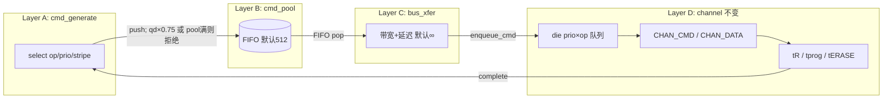

# cmd_sched 重构设计：Generate → Pool → Bus → Channel

> 状态：**P0 已实现**（generate → pool → bus → channel）  
> 目标：在 **不改变 channel 及以下行为** 的前提下，把 host 命令路径拆成三层。

---

## 1. 背景与动机

### 1.1 现状（单文件 `cmd_sched.c`）

```
perf_run 主循环
    │
    ├─ perf_gen_cmd()          选 op/prio/stripe，直接 enqueue 到 die 队列
    │
    └─ channel 调度             try_schedule_cmd / read_data / write_data
           │
           └─ die slot 状态机 → CHAN_CMD / CHAN_DATA / tR / tprog ...
```

问题：

- **Generate 与 Backend 耦合**：`perf_gen_cmd()` 在产生命令的同时就算好 `(chan, die)` 并 `enqueue_cmd()`，无法单独建模 host 侧 QD、pool 背压、总线带宽。
- **背压语义混乱**：`inflight_cmds` 与 `qd`、`map[]`、`die 队列` 混用；`tmp_cmd_cnt = qd * 0.75` 是隐式 pool 限制。
- **缺少总线层**：DESIGN.md 也写明当前不含内部总线/PCIe；无法解释 front-end 带宽上限。

### 1.2 重构后目标数据流

```
┌─────────────┐    push     ┌──────────┐   dispatch   ┌─────────┐   enqueue   ┌──────────────┐
│ cmd_generate│ ──────────► │ cmd_pool │ ────────────► │ bus_xfer│ ──────────► │ die 队列      │
│   (Host)    │  背压拒绝   │ (默认512)│  带宽受限     │ (默认∞) │  (现有逻辑)  │ channel 调度  │
│             │             │          │              │         │             │ (不变)        │
└─────────────┘             └──────────┘              └─────────┘             └──────────────┘
                                                                                      │
                                                                                      ▼
                                                                              CHAN_CMD / CHAN_DATA
                                                                              tR / tprog / tERASE
```

**不变范围（Phase 1）**：

- `chan_t` 状态机、`plane_slot_t` / `die_ctx_t` 状态机
- `try_schedule_cmd` / `try_schedule_read_data` / `try_schedule_write_data`
- page stripe 写路径（1 CMD + 8×DATA/tprog）、suspend、IOPS/BW 统计口径

**变化范围**：

- 命令从 host 到 die 队列的路径
- `perf_gen_cmd` 拆成 generate + pool
- 新增 bus 传输延迟/带宽模型
- `perf_run` 主循环增加 bus 调度步

---

## 2. 分层职责

### 2.1 Layer A — `cmd_generate`（命令产生）

**职责**：按 workload / ratio / stripe 规则**构造 host 命令描述符**，推入 cmd pool。

**不负责**：

- 不占用 channel / die slot
- 不决定何时上 die 队列（由 bus + channel 调度决定）
- 不模拟 tR / tprog

**输入**：`perf_config_t`、全局 stripe 游标、随机种子

**输出**：写入 pool；成功返回 1，背压时返回 0

**保留现有逻辑**（从 `perf_gen_cmd` 平移）：

| 字段 / 行为 | 说明 |
|-------------|------|
| `op` | `select_op()` / fulldev 固定读写 |
| `prio` | `select_prio()`（仍写入 act，供 die 队列使用） |
| `stripe_base` | page block stripe 时 `global_page_stripe += pages_per_block` |
| `page_stripe` | fulldev / page stripe 模式标志 |
| `target_chan`, `target_die` | bus dispatch 路由（page0 入队点，与现 `enqueue_cmd` 一致） |
| write stripe 元数据 | `cmd_write_cmd_sent/done`、`cmd_pages_*` 初始化为 0 |

**Generate 准入条件**（全部满足才 push pool）：

| 条件 | 行为 |
|------|------|
| `inflight_cmds >= tmp_cmd_cnt` | **拒绝**（**保留** `tmp_cmd_cnt = qd * 0.75` / `qd * 0.8`） |
| `pool.count >= cmd_pool_size` | **拒绝** |
| `map` 无空闲 act | 拒绝 |
| `total_cmd >= element` | 停止 generate |

> **已定稿 Q1**：`qd*0.75` 限流 **保留**；与 pool 容量为 **双重背压**，任一触发即拒绝。

**与 `qd` 的关系**：

- `qd`：host 侧 **act 描述符槽位总数**（`act ∈ [0, qd)`）
- act 槽在 **整条 host 命令生命周期结束** 时释放（与现 `complete_host_page_stripe` / `map[act]=0` 一致）

---

### 2.2 Layer B — `cmd_pool`（命令池）

**职责**：host 已提交、尚未经总线送达 backend 的命令缓冲。

**默认容量**：`cmd_pool_size = 512`（新配置项，与 `iwl_slot` 默认 512 对齐，但语义独立）

**行为**：

```
push(act)  → count < capacity ? 入队 : 拒绝 (generate 返回 0, pool_rejects++)
pop()      → 仅由 bus 层调用；FIFO 队首
peek/is_empty/count
```

**队列结构**（已定稿 Q4：**不按 prio 排队**）：

```c
typedef struct cmd_pool {
    int capacity;      /* 默认 512 */
    int count;
    queue_t fifo;      /* 单 FIFO，元素为 act(int) */
} cmd_pool_t;
```

`cmd_prio[act]` 仍由 generate 写入；**prio 排序仅在 die 队列生效**（channel 层 `try_schedule_cmd` 不变）。

**统计**（已定稿 Q6）：

- `pool_rejects` — push 因 pool 满被拒绝次数
- `pool_high_watermark`（可选 debug）

---

### 2.3 Layer C — `bus_xfer`（总线传输）

**职责**：从 cmd pool **FIFO pop** 命令，模拟 **front-end 总线传输**，完成后 **enqueue 到 die 队列**（现有 `enqueue_cmd`）。

**默认带宽**（已定稿 Q2）：`bus_bandwidth = 0` → 内部 `UINT64_MAX`，**不限速**。

**可配置有限带宽**：`bus_bandwidth=8000` 表示 8000 MB/s（与现有 BW 输出单位一致）。

#### 2.3.1 总线状态机

```c
typedef enum {
    BUS_IDLE,
    BUS_XFER,
} bus_state_t;

typedef struct bus_xfer {
    bus_state_t state;
    uint64_t busy_until;   /* sim_time 时间戳 */
    int active_act;        /* 正在传输的 act，-1 表示无 */
} bus_xfer_t;
```

#### 2.3.2 单次 CMD 传输时间（已定稿 Q3）

```
xfer_bytes = bus_cmd_bytes    /* 默认 64B admin，与 block_size 无关 */
xfer_time  = bus_base_latency_us * TIME_SCALE
           + xfer_bytes * TIME_SCALE / bus_bytes_per_us   /* 不限速时该项为 0 */

bus_bytes_per_us = bus_bandwidth_mbps * 1048576 / 1000000 / TIME_SCALE
```

**首版**：整 cmd 一次传完（不分片）。**DATA 仅在 channel 层**用 `chan_speed` 建模。

#### 2.3.3 调度时机

```
1. bus_tick(sim_time)       — XFER 完成则 enqueue_cmd + BUS_IDLE + bus_xfers++
2. bus_try_start(sim_time)  — BUS_IDLE 且 pool 非空则 pop + start XFER
```

**与 channel 关系**：

```
Host → [pool FIFO 等待] → [bus xfer] → [die 队列, 仍按 prio×op] → [CHAN_CMD cmd_time] → ...
```

#### 2.3.4 路由

bus 完成时：

```c
enqueue_cmd(cmd_target_chan[act], cmd_target_die[act],
            cmd_op[act], cmd_prio[act], act);
```

#### 2.3.5 page stripe 写（已定稿 Q5）

- generate / pool / bus：**每条 host block 仅 1 次**（一个 act）
- bus 完成后进入 page0 对应 die 队列
- 后续 **1 CMD + 8×(DATA + tprog) 仍在 channel 层**，逻辑不变

---

### 2.4 Layer D — Channel 及以下（保持不变）

以下 **Phase 1 原样保留**，命令来源改为 bus enqueue：

- `try_schedule_cmd` / `try_schedule_read_data` / `try_schedule_write_data`
- `try_launch_striped_pages` / write 1-CMD + parallel DATA/tprog
- `complete_wait_ops` / `complete_host_page_stripe`
- suspend 机制
- `CHAN_CMD` / `CHAN_DATA` 状态转移

**替换**：

- `perf_gen_cmd` 内 `enqueue_cmd()` → `cmd_pool_push()`
- `perf_run`：`cmd_generate_try()` + `bus_tick/try_start()` + 现有 channel 循环

**`inflight_cmds` 语义**：

- 仍表示「已 generate 且未完成」的 host 命令数
- push pool 成功：`inflight_cmds++`
- complete 时：`inflight_cmds--`
- **保留** `inflight_cmds >= tmp_cmd_cnt` 作为 generate 上限（与 pool 背压并列）

---

## 3. 数据结构

### 3.1 Host 命令（沿用 act + 侧车数组）

```c
/* 已有 */
int *cmd_op, *cmd_prio, *map;
int *cmd_stripe_base, *cmd_page_stripe, *cmd_pages_*;

/* 新增 */
int *cmd_target_chan;
int *cmd_target_die;
cmd_pool_t pool;
bus_xfer_t bus;
```

### 3.2 配置项（`perf.conf`）

| Key | 默认 | 说明 |
|-----|------|------|
| `cmd_pool_size` | `512` | pool 容量 |
| `bus_bandwidth` | `0` | MB/s；`0` = 不限 |
| `bus_cmd_bytes` | `64` | 每条 host cmd 总线字节 |
| `bus_base_latency` | `0` | 固定总线延迟（µs） |

### 3.3 统计项（`perf_stats_t`，已定稿 Q6）

| 字段 | 说明 |
|------|------|
| `pool_rejects` | pool 满导致 generate 拒绝次数 |
| `bus_xfers` | bus 完成传输次数 |
| `bus_bytes` | bus 累计传输字节 |

建议在 `main.c` 稳态输出中打印（或 `--debug` 开关）。

---

## 4. 主循环时序（重构后）

```c
while (!done) {
    tmp_cmd_cnt = (qd >= 512) ? qd * 0.75 : qd * 0.8;

    cmd_generate_try(tmp_cmd_cnt, &inflight_cmds);  /* qd*0.75 + pool 双重背压 */

    bus_tick(sim_time);
    bus_try_start(sim_time);

    for each channel i {
        switch (chan[i].state) { ... }  /* 不变 */
    }

    if (!progressed) sim_time = next_event;  /* 含 bus.busy_until */
}
```

---

## 5. 文件/module 拆分建议

| 文件 | 内容 |
|------|------|
| `cmd_generate.c/h` | `select_op/prio/target`，`cmd_generate_try()` |
| `cmd_pool.c/h` | FIFO push/pop |
| `bus_xfer.c/h` | bus 状态机 |
| `cmd_sched.c` | channel/die 调度、`perf_run`、config、stats |

首版可在 `cmd_sched.c` 内分块，通过后再物理拆文件。

---

## 6. 行为对比与验证

### 6.1 默认配置

```
cmd_pool_size = 512
bus_bandwidth = 0
bus_base_latency = 0
qd*0.75 限流保留
```

→ 默认 generate 仍主要受 `qd*0.75` 约束（pool 512 通常不先满）；bus 零延迟；channel 不变。  
**期望**：fulldev 带宽与重构前接近。

### 6.2 瓶颈测试

| 场景 | 配置 | 期望 |
|------|------|------|
| Pool 背压 | `cmd_pool_size=32` | `pool_rejects` 升高，BW 可能下降 |
| 总线限速 | `bus_bandwidth=8000` | BW 上限 ≈ bus |
| 双重背压 | 小 pool + qd*0.75 | 取更严约束 |

### 6.3 回归清单

- [ ] legacy mixed + channel_major
- [ ] fulldev_seq_read + page_across_chan
- [ ] fulldev_seq_write + page_die_rotate
- [ ] suspend
- [ ] IOPS/BW + pool_rejects / bus_xfers 输出

---

## 7. 实现阶段

| Phase | 内容 |
|-------|------|
| **P0** | generate + pool(FIFO) + bus(无限) + stats |
| **P1** | bus 带宽/延迟可配 |
| **P2** | 物理拆文件 |

**不在 Phase 1**：DATA 走 bus；pool 按 prio 排队。

---

## 8. 已定稿决策（Review 结论）

| # | 问题 | **结论** |
|---|------|----------|
| Q1 | `qd*0.75` 限流 | **保留**，与 pool 容量双重背压 |
| Q2 | bus 默认带宽 | **不限速**（`0` = UINT64_MAX） |
| Q3 | bus 传 admin cmd | **是**，64B 默认，DATA 在 channel |
| Q4 | pool 按 prio 排队 | **否**，单 FIFO；prio 仅 die 队列 |
| Q5 | page stripe 写 | **是**，pool/bus 各 1 次，channel 不变 |
| Q6 | 统计 | **是**，`pool_rejects` / `bus_xfers` / `bus_bytes` |

---

## 9. 架构图



---

## 10. 小结

| 层 | 作用 | 默认 |
|----|------|------|
| **generate** | 产生 host cmd | 同现 `perf_gen_cmd`；**qd×0.75 + pool 双背压** |
| **pool** | 等 bus 的 FIFO 缓冲 | 512 |
| **bus** | front-end cmd 传输 | 不限速；64B/cmd |
| **channel** | NAND 调度 | **不改** |

**下一步**：按 P0 实现，默认配置回归通过后合并 `active-dev`。
